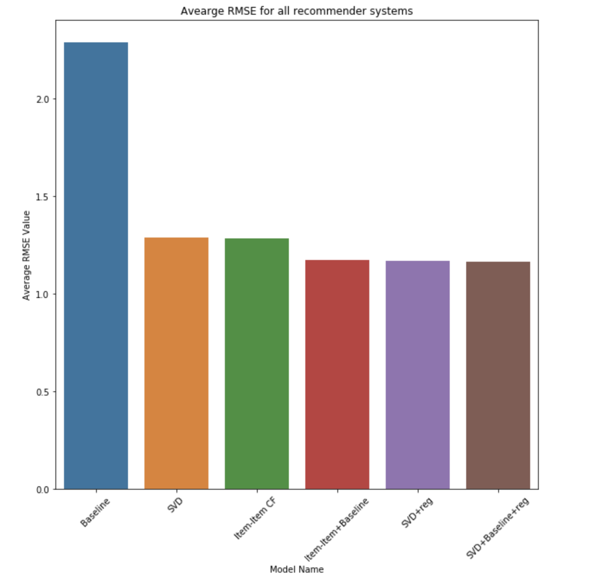
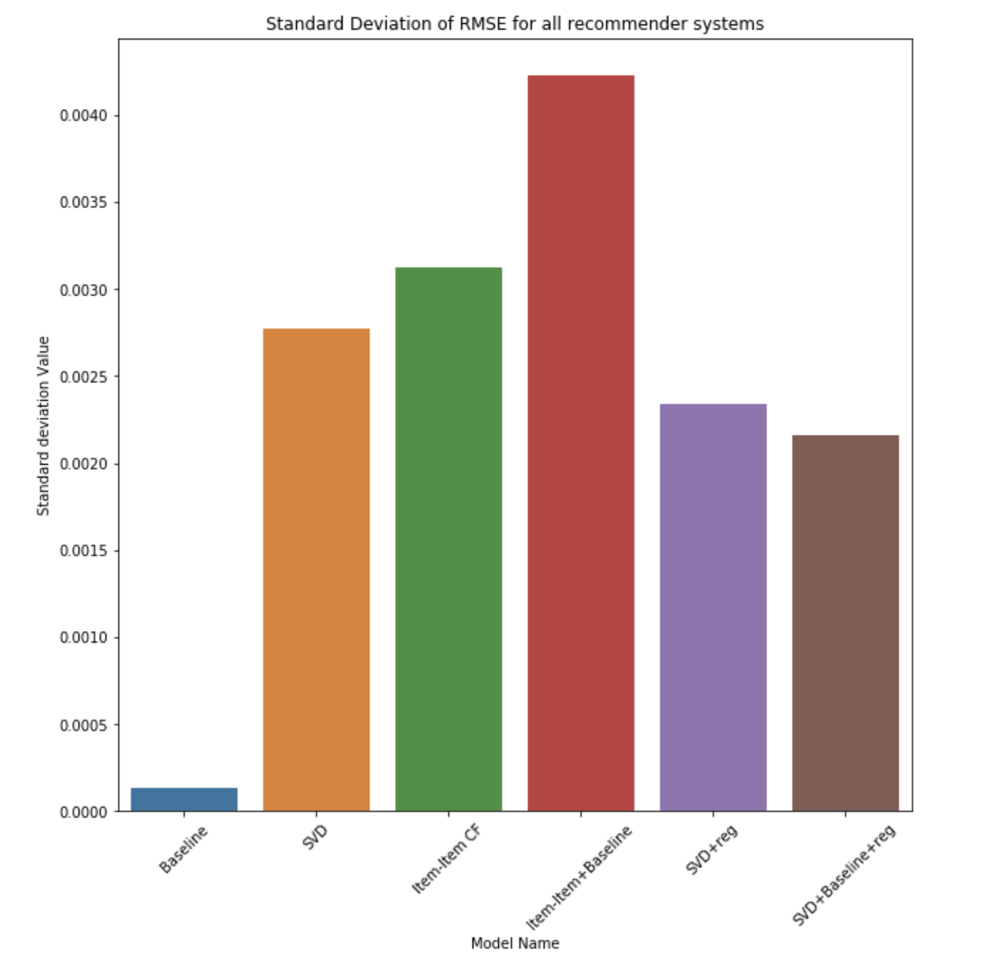

# Title: Recommender Systems for Yelp Users

--Author 
--Vashatkar 

### Summary : 

•	Designed and built recommender systems to suggest best food businesses for users based on the Yelp dataset filtered to around 200k ratings with approximately 2000 businesses.

•	Implemented recommender systems using Baseline approach , Item- Item Collaborative Filtering , Latent Factors models involving Matrix Factorization. Combined these techniques to make hybrid models in order to get better results. RMSE (Root Mean Squared Error) was used as evaluation metric to compare different models and achieved best RMSE score of ‘1.166’ with hybrid model implemented using SVD with regularization and Baseline methods.

### Problem Definition : 

 - Given the ratings for businesses by yelp users (known ratings), predict the probable ratings (unknown ratings) 
 
 - The Goal of this project is to build a recommender system with the following properties :
 
  1. Robust - Resilient to variances in data
  
  2. High prediction accuracy - Estimate ratings likely to be given by the user
  
### Existing Methods:

  1. Content-Based recommendation system
  
        - Recommendations based on item and user profiles manually selecting features
        
  2. Collaborative filtering (CF) 
  
     i. Item-Item CF
     
        - Extrapolate item rating based on ratings of similar items. 
        
     ii. User-User CF
     
        - Identifying similar users and recommending what similar users like 
        
  3. Latent Factor Models
  
      i. Singular Value Decomposition (SVD)
      
        - Represent users and items using latent (hidden) factors

### Proposed Method:

I. Build Recommender systems using the different existing methods (stated above) and compare the models based on the average of RMSE values computed through k-fold cross-validation

II. Methods implemented:

  1. Baseline approach
  
  2. Item–Item collaborative filtering
  
      - Similarity metric used : Pearson correlation coefficient
      
  3. SVD
  
  4. SVD with Regularization 
  
  5. Hybrid methods:
  
      - Baseline and Item Item collaborative filtering
      
      - Baseline and SVD with Regularization
      
III. Once there is an extrapolated value for each user and item from our model's result, we can recommend the user with top-n items or in context of social networking, we can recommended other similar users to the each of our user.

### Data Description & Experimental Setup :

I. Data (after filtering) used for building models comprises of 200,000 ratings given by 31,824 users to 2061 food-related businesses.

II. Handling Cold Start problem:

  - Filtered data with constraints :
  
      - Business rated by minimum 20 users § Users with a minimum of 2 ratings
      
III. Experimental setup to obtain RMSE: 

  1. Divide data into k-folds
  
  2. For each model do
  
      - Repeat k times
      
       - Run model on k-1 folds and compute RMSE on hold out fold
        
  3. Report the RMSE of each fold for all models

### Results and Discussion :
  
  It can be inferred from the following figures (fig 1, fig 2, fig 3) that,

1. Model efficiency: (against bias problem)

  Across all models, (from figure 1 and figure 2)
  
  - Non-hybrid models did not have enough parameters to capture the patterns in data which resulted in high error
  
  - Hybrid methods performed well showing low errors on all folds
  
2. Robustness : (against overfitting problem)

  - From figure 3, Models with regularization gave better results with less deviations in RMSE values.

Figure 1 shows the RMSE values for each of the fold in k-fold cross-validation of our models (Here, k = 5).

 

 Figure 1: RMSE across 5-folds for each of the recommender system model 

 
 
 

 Figure 2: Average RMSE of 5-folds for each of the recommender system model 

 
 
 

 Figure 3: Standard deviation in RMSE of 5-folds for each of the recommender system model 

### Conclusion: 
  
  Multiple Machine learning models were implemented to predict the probable ratings. Firstly, a model predicting baseline estimates was built and found that the global averages method (Baseline) haven’t yielded any promising RMSE scores. Then taking the similarities into account, item-item collaborative filtering, and a hybrid model that incorporates Baseline into item-item collaborative filtering method were implemented to get better results. Later part of the project mainly focused on latent factor models which are widely used in real world systems. Started off with basic SVD model and further built hybrid model incorporating both regularization and global averages (Baseline) to SVD that resulted in the best model with low RMSE value. It can be concluded that hybrid models tend to perform better in comparison to simpler models and regularization technique of latent factors further improved RMSE score with low standard deviations across 5-folds.

### Takeaway Points & Future Work :

1. Use combinations of different methods (that is., ensemble methods)

2. Regularization prevents overfitting

3. **Future Work:** In future, hybrid methods can be built by taking temporal and seasonal biases into account. Further, we can use clustering techniques to aid in getting the similar items for collaborative filtering.

### References: 
 
[1] D. Goldberg, D. Nichols, B. M. Oki, and D. Terry, “Using collaborative filtering to weave an information tapestry,” Communications of ACM, vol. 35, no. 12, pp. 61–70, 1992.

[2] G. Linden, B. Smith, and J. York, “Amazon.com recommendations: item-to-item collaborative filtering,” IEEE Internet Computing, vol. 7, no. 1, pp. 76–80, 2003.

[3] P. Resnick and H. R. Varian, “Recommender systems,” Communications of the ACM, vol. 40, no. 3, pp. 56–58, 1997.

[4] J. Leskovec, A. Rajaraman, J. Ullman: Mining of Massive Datasets, http://www.mmds.org .

**Files Description :**

- " Recommender systems_read_files.ipynb " file contains code to read data files, preprocess the data and store data as csv file.

- " recomender_systems_latest.ipynb " file contains code for all the recommender system models and results are stored in csv file.

- "recommender_systems_results.ipynb" file is used for plotting the results from results obtained from models.
